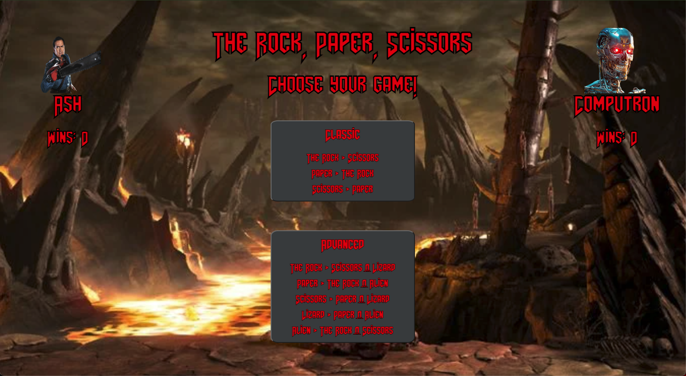
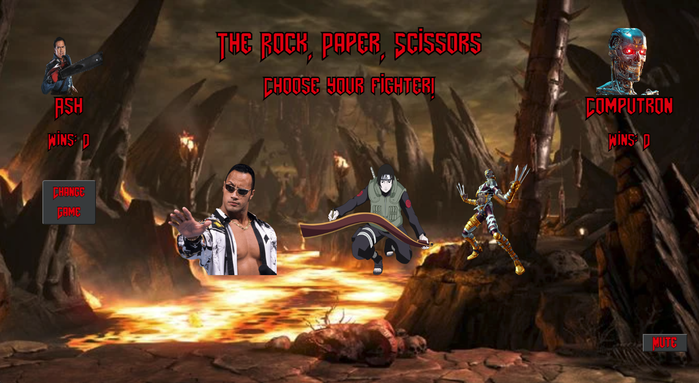
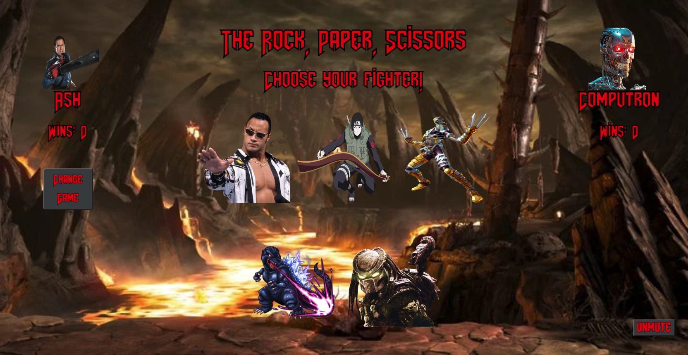

# DwayneJohnson-Paper-Scissors

## Introduction
The Rock, Paper, Scissors is a site that allows the user to play the classic version of Rock, Paper, Scissors as well as an advanced version that throws two extra options (Lizard & Alien) into the mix.

The project spec & rubric can be found [here!](https://frontend.turing.edu/projects/module-1/rock-paper-scissors-solo-v2.html)

## Deployed Page
Visit the published The Rock, Paper, Scissors [site!](https://NickLiggett.github.io/DwayneJohnson-Paper-Scissors/)

## Features
When a user clicks on the mode they wish to play (Classic or Advanced), the page starts to play a battle song for the user's enjoyment (for which there is a mute button) and populates a number of fighter icons respective to the mode selected. The win conditions are stated on the mode selection buttons. A tally of wins is kept for each player and those wins remain until the page is refreshed. "Flawless Victory" means you won the round, "You Die" means you lost, and "Sudden Death" means there was a draw.

 

 

 

## Contributors
This website was built by the following front end engineering student with the [Turing School of Software and Design](https://turing.edu/).

  - [Nick Liggett](https://github.com/NickLiggett)

## Possible Future Extensions
  - Keep win counts after a refresh using local storage.
  - Add personalized sound effects for individual fighter icons.

## Technologies
  - Javascript
  - HTML
  - CSS
  
## Sources
  - [MDN](http://developer.mozilla.org/en-US/)
  - [Stack Overflow](https://stackoverflow.com/)
